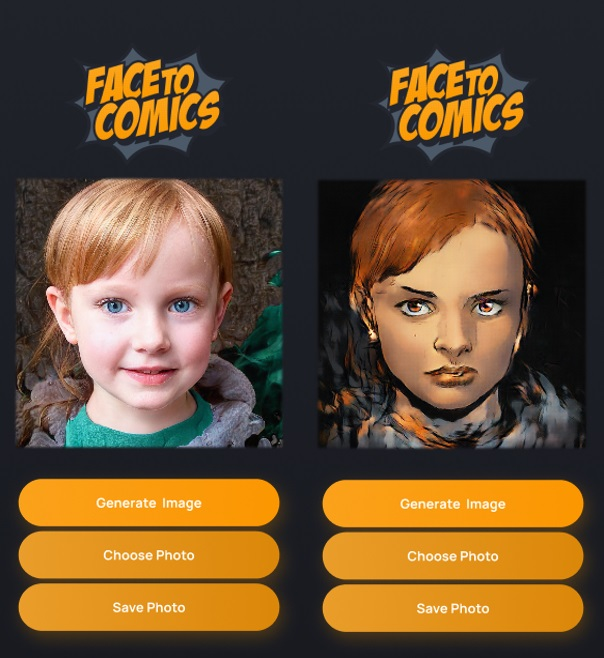

# Face2Comics
Цель проекта - реализовать модель генеративно-состязательной нейронной сети для обработки портретных фотографий и интегрировать ее в мобильное приложение.

## Results
||
|:---:|
||

### Model CoreML
Ссылка на модель CoreML на Google Drive: [link](https://drive.google.com/file/d/1OgxIYtzzUfKBPuLQ8KxVBP0w9Chr1xqM/view?usp=sharing).

Ссылка на проект Pix2Pix: [link](https://github.com/ValeryShestakovv/Pix2Pix)
